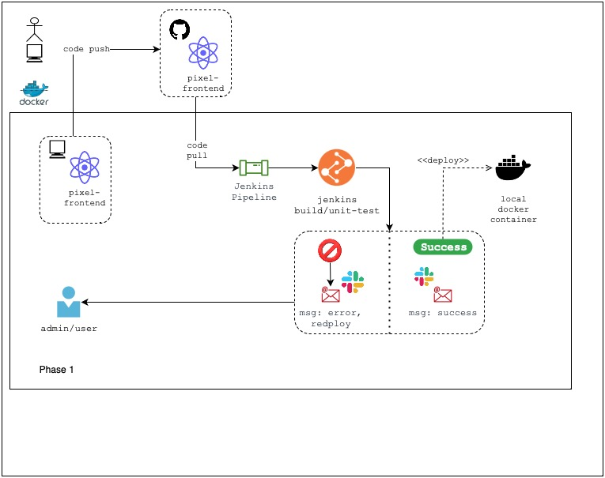

# attend

Full Stack attendance app. The whole app can run locally on docker containers

## Technical Diagram

1. `Frontend - Phase1` 

# How to install and use
Make sure you have docker and docker-compose installed

run `docker-compose up -d` to build image and container 1st time

run `docker-compose up --build -d` to rebuild

### ports
1. frontend - http://localhost:3000/
2. backend - http://localhost:9000/posts 

#### - test jenkins polling